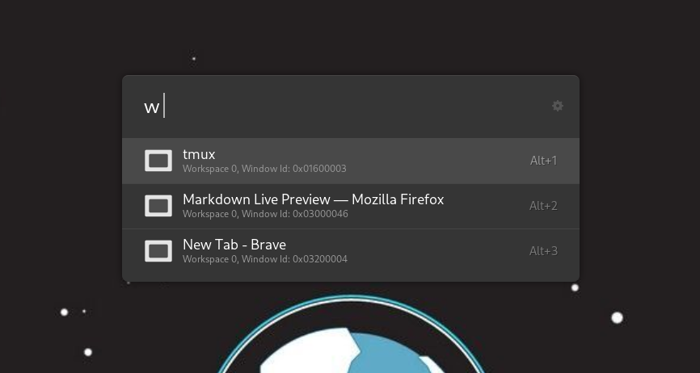

# Linux/X11 Window Switcher plugin for Ulauncher

This is a plugin for [Ulauncher](https://ulauncher.io/) that lets you search and switch between Linux/X11 Windows by name:



The default keyword is `w`, run Ulauncher, then type `w <query>` to filter the window list, then select a window from the list to switch to that window.

## Requirements

You need `wmctrl` installed.

For Arch, you can do:

```shell
sudo pacman -S wmctrl
```
